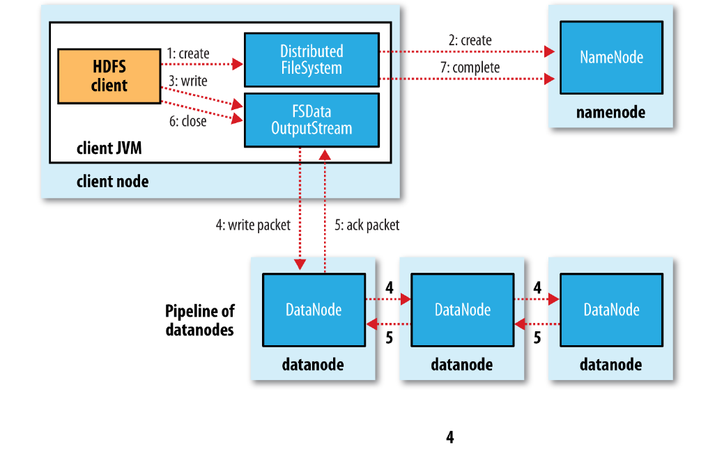

最近参加的面试，一面问了HDFS写文件流程，完了之后把《Hadoop权威指南》上的流程配合源码简单的看了一遍。二面又问到了这个问题，一些细节还是漏了，对这部分还是专门记个笔记吧。稍微梳理了一下，发现感觉这个问题确实太适合作为面试题了，有细节还适合引申到其它的点。

 
# 写数据流程
 
大体流程如图（来自《Hadoop权威指南》）



1. 客户端通过DistributedFileSystem的create()创建文件，中间会对namenode创建RPC调用（namenode.create)，namenode在检查权限等问题后新建文件。
2. 创建完文件后会返回FSDataOutputStream，在DFSOutputStream上的一层包装，用于处理写入数据所需要的namenode和datanode之间的通信。
3. 在数据写入过程中，DFSOutputStream会将数据划分为packets，并放入data queue，由DataStreamer处理（向namenode申请分配新的block）。
4. 被选择的datanode连起来构成pipeline，DataStreamer流式的将packets发送到第一个datanode，第一个datanode每次收到packet后存储并转发到pipeline上下一个datanode。
5. DFSOutputStream还维护了一个ack queue，当所有的datanode都应答后对应的packet会被移除。

## 源码分析

以下代码来自Hadoop 2.7.7。

FileSystem.get()通过URI返回对应的DistributedFileSystem，调用create函数在namenode上创建文件，返回输出流。

```java
Configuration conf = new Configuration();
FileSystem hdfs = FileSystem.get(URI.create(hdfsDirectory), conf);
FSDataOutputStream outputStream = hdfs.create(new Path(hdfsDirectory));
outputStream.writeInt(1);
outputStream.close();
```

DistributedFileSystem的create()中，通过DFSClient的对象dfs，调用dfs.create()。中间使用了FileSystemLinkResolver<T>类，当doCall函数中抛出UnresolvedLinkException时（解析Path路径失败），会重新解析路径得到合适的FileSystem和Path传入next()。总体上相当于给定的路径解析失败时，重新解析后再次调用create函数。创建完成后对返回的DFSOutputStream外套了一层FSDataOutputStream用于写结果。

```java
final DFSOutputStream out = dfs.create(getPathName(f), permission,
    overwrite ? EnumSet.of(CreateFlag.CREATE, CreateFlag.OVERWRITE)
        : EnumSet.of(CreateFlag.CREATE),
    true, replication, blockSize, progress, bufferSize, null,
    favoredNodes);
return dfs.createWrappedOutputStream(out, statistics);

```

dfs.create() 调用了DFSOutputStream.newStreamForCreate(...)。


```java
  public DFSOutputStream create(String src, 
	                        //...
                            InetSocketAddress[] favoredNodes) throws IOException {
    //...
    final DFSOutputStream result = DFSOutputStream.newStreamForCreate(this,
        src, masked, flag, createParent, replication, blockSize, progress,
        buffersize, dfsClientConf.createChecksum(checksumOpt),
        getFavoredNodesStr(favoredNodes));
	// ...
    return result;
  }
```

DFSOutputStream.newStreamForCreate(...)。首先通过RPC到namenode上调用create函数(dfsClient.namenode.create)，然后new DFSOutputStream并启动。此时，文件在namenode上的创建完成，可以开始写入。

```java
static DFSOutputStream newStreamForCreate(DFSClient dfsClient, String src,
    FsPermission masked, EnumSet<CreateFlag> flag, boolean createParent,
    short replication, long blockSize, Progressable progress, int buffersize,
    DataChecksum checksum, String[] favoredNodes) throws IOException {
		// ...
       stat = dfsClient.namenode.create(src, masked, dfsClient.clientName,
            new EnumSetWritable<CreateFlag>(flag), createParent, replication,
            blockSize, SUPPORTED_CRYPTO_VERSIONS);
		// ... 
    }
	// ...
    final DFSOutputStream out = new DFSOutputStream(dfsClient, src, stat,
        flag, progress, checksum, favoredNodes);
    out.start();
    return out;
}
```

有了DFSOutputStream后的代码不能直接跳，DFSOutputStream的写数据会进入类中覆盖的writeChunk()，在writeChunkImpl()中实现具体的逻辑。主要过程为：当currentPacket为空时，创建一个新的DFSPacket，然后写入checkSum、data等信息，在DFSPacket里的chunk数量或者大小达到一定值时，会将当前的DFSPacket放入dataQueue队列中。

```java
  @Override
  protected synchronized void writeChunk(byte[] b, int offset, int len,
      byte[] checksum, int ckoff, int cklen) throws IOException {
    TraceScope scope =
        dfsClient.getPathTraceScope("DFSOutputStream#writeChunk", src);
    try {
      writeChunkImpl(b, offset, len, checksum, ckoff, cklen);
    } finally {
      scope.close();
    }
  }

  private synchronized void writeChunkImpl(byte[] b, int offset, int len,
          byte[] checksum, int ckoff, int cklen) throws IOException {

	//...
    if (currentPacket == null) {
      currentPacket = createPacket(packetSize, chunksPerPacket, 
          bytesCurBlock, currentSeqno++, false);
	}
	//...

    currentPacket.writeChecksum(checksum, ckoff, cklen);
    currentPacket.writeData(b, offset, len);
    currentPacket.incNumChunks();
    bytesCurBlock += len;

    // If packet is full, enqueue it for transmission
    //
    if (currentPacket.getNumChunks() == currentPacket.getMaxChunks() ||
        bytesCurBlock == blockSize) {
	  //...
      waitAndQueueCurrentPacket();
      adjustChunkBoundary();

      // if encountering a block boundary, send an empty packet to 
      // indicate the end of block and reset bytesCurBlock.
      //
      if (bytesCurBlock == blockSize) {
        currentPacket = createPacket(0, 0, bytesCurBlock, currentSeqno++, true);
        currentPacket.setSyncBlock(shouldSyncBlock);
        waitAndQueueCurrentPacket();
        bytesCurBlock = 0;
        lastFlushOffset = 0;
      }
    }
  }
```

DFSOutputStream并没有直接在writeChunk()中将数据写入datanode，而是创建了DFSPacket写入到dataQueue中。DataStreamer在另外的一个线程将dataQueue中的数据写入到datanode。

DataStreamer的写入流程，主要在其线程函数run()中。这个地方在《Hadoop权威指南》里没有特别的提，代码流程主要如下：

1. 等待当前packet发送完毕后，从dataQueue中取一个新的packet；
2. 如果当前stage状态为PIPLINE_SETUP_CREATE
 2.1 rpc到namenode添加新的block，向pipline中第一个datanode建立socket连接，构建输出流并发送WRITE_BLOCK指令；
 2.2 启动新的ResposeProcesser，并将当前的stage状态改为PIPLINE_STREAMING;
3. 判断当前的packet是否为当前block中的最后一个packet，如果是则将stage状态改为PIPLINE_CLOSE；
4. 将当前的packet从dataQueue中移除，并放入ackQueue，向输出流中写入packet；
5. 如果是当前block的最后一个packet，则结束当前的输出流（关闭response、关闭输出流、删除pipline信息、设置状态为PIPLINE_SETUP_CREATE）。

DFSClient与datanode的通信（写数据）并非用的RPC，而是直接用NetUtils.createSocketAddr()连接到datanode，然后向datanode发送Op.WRITE_BLOCK指令告诉datanode执行写block的命令。

ResponseProcessor在单独的线程中处理datanode回复的ack（每个block会新建一个ResponseProcessor，对应一个新线程），当成功的收到datanode的ack时，会将ackQueue中对应的packet移除。

```java
 //
  // The DataStreamer class is responsible for sending data packets to the
  // datanodes in the pipeline. It retrieves a new blockid and block locations
  // from the namenode, and starts streaming packets to the pipeline of
  // Datanodes. Every packet has a sequence number associated with
  // it. When all the packets for a block are sent out and acks for each
  // if them are received, the DataStreamer closes the current block.
  //
class DataStreamer extends Daemon {
    //...

      /*
     * streamer thread is the only thread that opens streams to datanode, 
     * and closes them. Any error recovery is also done by this thread.
     */
    @Override
    public void run() {
		// ...
        DFSPacket one;
        try {
		  // ...
          synchronized (dataQueue) {
            // wait for a packet to be sent.
            if (dataQueue.isEmpty()) {
              one = createHeartbeatPacket();
              assert one != null;
            } else {
              one = dataQueue.getFirst(); // regular data packet
            }
          }

          // get new block from namenode.
          if (stage == BlockConstructionStage.PIPELINE_SETUP_CREATE) {
            setPipeline(nextBlockOutputStream()); 
			// nextBlockOutputStream 中会调用namenode的rpc添加新的block
			// 然后建立与pipline中第一个Datanode的socket连接，并写入指令告诉Datanode进入block写模式

            initDataStreaming(); // 启动ResposeProcesser对应的线程，并将当前的状态改为PIPELINE_STREAMING
          } else if (stage == BlockConstructionStage.PIPELINE_SETUP_APPEND) {
		  // 对block的append模式

            setupPipelineForAppendOrRecovery();  // 此过程会调用namenode的RPC更新block
			// LocatedBlock lb = dfsClient.namenode.
			//                 updateBlockForPipeline(block.getCurrentBlock(), dfsClient.clientName);

            initDataStreaming();
          }

	      long lastByteOffsetInBlock = one.getLastByteOffsetBlock();
          if (lastByteOffsetInBlock > blockSize) {
            throw new IOException("BlockSize " + blockSize +
                " is smaller than data size. " +
                " Offset of packet in block " + 
                lastByteOffsetInBlock +
                " Aborting file " + src);
          }

          // 当前packet(one)是block中的最后一个packet时
          if (one.isLastPacketInBlock()) {
            // wait for all data packets have been successfully acked
            synchronized (dataQueue) {
              while (!streamerClosed && !hasError && 
                  ackQueue.size() != 0 && dfsClient.clientRunning) {
                try {
                  // wait for acks to arrive from datanodes
                  dataQueue.wait(1000);
                } catch (InterruptedException  e) {
                  DFSClient.LOG.warn("Caught exception ", e);
                }
              }
            }
            if (streamerClosed || hasError || !dfsClient.clientRunning) {
              continue;
            }
            stage = BlockConstructionStage.PIPELINE_CLOSE;
          }
          

          Span span = null;
          synchronized (dataQueue) {
            // move packet from dataQueue to ackQueue
            if (!one.isHeartbeatPacket()) {
              span = scope.detach();
              one.setTraceSpan(span);
              dataQueue.removeFirst();
              ackQueue.addLast(one);
              dataQueue.notifyAll();
            }
          }

          //  这里才到了向第一个数据节点写数据的地方
		  // write out data to remote datanode
          TraceScope writeScope = Trace.startSpan("writeTo", span);
          try {
            one.writeTo(blockStream);
            blockStream.flush();   
          } catch (IOException e) {
            // HDFS-3398 treat primary DN is down since client is unable to 
            // write to primary DN. If a failed or restarting node has already
            // been recorded by the responder, the following call will have no 
            // effect. Pipeline recovery can handle only one node error at a
            // time. If the primary node fails again during the recovery, it
            // will be taken out then.
            tryMarkPrimaryDatanodeFailed();
            throw e;
          } finally {
            writeScope.close();
          }
          lastPacket = Time.monotonicNow();
          
          // update bytesSent
          long tmpBytesSent = one.getLastByteOffsetBlock();
          if (bytesSent < tmpBytesSent) {
            bytesSent = tmpBytesSent;
          }

          if (streamerClosed || hasError || !dfsClient.clientRunning) {
            continue;
          }

	      // 当最后一个packet写完后结束当前的block写过程
          if (one.isLastPacketInBlock()) {
            // wait for the close packet has been acked
            synchronized (dataQueue) {
              while (!streamerClosed && !hasError && 
                  ackQueue.size() != 0 && dfsClient.clientRunning) {
                dataQueue.wait(1000);// wait for acks to arrive from datanodes
              }
            }
            if (streamerClosed || hasError || !dfsClient.clientRunning) {
              continue;
            }
            endBlock();
          }
          if (progress != null) { progress.progress(); }

          // This is used by unit test to trigger race conditions.
          if (artificialSlowdown != 0 && dfsClient.clientRunning) {
            Thread.sleep(artificialSlowdown); 
          }
    }
		  
		  
  private class ResponseProcessor extends Daemon { 
  }
    
```
   
# 写数据失败的处理

当datanode写入数据失败。pipeline会被关闭，ack queue中的所有packet会被添加到data queue的头部，未发生故障的datanode会将当前的block标记后发送给namenode，使namenode能够正确的删除发生故障的datanode上未完成的block。发生问题的datanode会从pipeline中移除，然后由剩下的datanode完成pipeline的数据传输。namenode在发现replica的数量不够时，会选择新的节点放置block。

可能会存在多个datanode同时失败的情况，但在写入过程中，只要有dfs.namenode.replication.min个副本写入到结果中就会被认为写入成功。其它的block会在集群中异步的复制直到达到要求的副本数。


写文件需要注意Hadoop对写可能存在失败，hflush hsync能够以更高开销为代价保证数据的安全。


# 一致性模型

A coherency model for a filesystem describes the data visibility of reads and writes for a file.

为了保证效率，HDFS的一致性并不满足组POSIX。主要表现在下面几个方面。

文件在创建后，对于文件系统是可见的，如下：

```java
Path p = new Path("p");
fs.create(p);
assertThat(fs.exists(p), is(true));
```

但是，文件的写入不一定是可见的，如下面的代码，即使已经flush到了文件，在马上获取文件内容时，得到的结果还是会为0。

```java
Path p = new Path("p");
OutputStream out = fs.create(p);
out.write("content".getBytes("UTF-8"));
out.flush();
assertThat(fs.getFileStatus(p).getLen(), is(0L));
```

在超过一个block写完后，第一个block会变为可见。

HDFS提供了一种机制强制写入，将上面的out.flush()换成out.hflush()时，HDFS会确定数据已经送到了所有datanode，此时所有数据会对Reader可见。调用close()时会调用hflush。

但是，hflush并不保证数据被写入到磁盘，而只是保证数据在datanode的内存中，要想有更强的保证，需要使用hsync()。

从安全性上看，没有调用hflush()和hsync()时，某些客户端或者系统的错误会导致数据的丢失。因此，这两个函数的调用与否，是在数据安全和吞吐量两方面的tradeoff。


