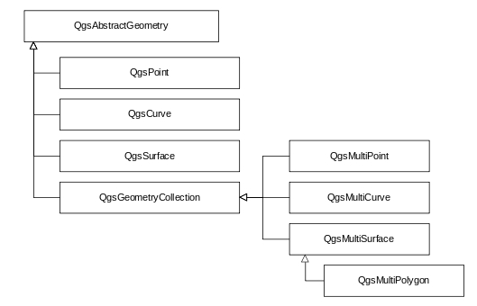

矢量数据在内存中的操作需要面对不同的属性字段，想到c++没有java的Object类作为不同数据类型的基类支撑，对c++动态处理属性字段比较疑惑，看了一下QGIS的相关实现。没有像猜测中直接使用指针操作，动态属性字段使用Qt的Variant类实现，通过QVector<Variant>的方式存储不同的属性数据。

QGIS的矢量数据的组织和OGC的简单要素类（Simple Feature）的[实现标准](https://www.ogc.org/standards/sfa)类似，每个矢量数据空间实体使用QgsFeature类的一个对象存储，每个OgsFeature对象有四个主要类成员：

```c++
Q_PROPERTY( QgsGeometry geometry READ geometry WRITE setGeometry )  // Feature的几何字段
Q_PROPERTY( QgsFeatureId id READ id WRITE setId )  // Feature的id
Q_PROPERTY( QgsAttributes attributes READ attributes WRITE setAttributes )  // Feature的属性值
Q_PROPERTY( QgsFields fields READ fields WRITE setFields )  // Feature的属性字段
```

其中QgsGeometry是空间信息的存储方式，负载点线面等空间对象的管理。内部的数据通过私有成员 `QgsGeometryPrivate *d` 存储，内部包含一个QgsAbstractGeometry智能指针 `std::unique_ptr< QgsAbstractGeometry > geometry`。QgsAbstractgeometry是几何对象的基类，其子类有QgsCurve、QgsPoint、QgsSurface以及存储多对象的QgsGeometryCollection，如下图：



QgsFields负责属性字段的管理，通常包含多个QgsField，每个QgsField包括以下属性：

```c++
Q_PROPERTY( bool isNumeric READ isNumeric )
Q_PROPERTY( bool isDateOrTime READ isDateOrTime )
Q_PROPERTY( int length READ length WRITE setLength )
Q_PROPERTY( int precision READ precision WRITE setPrecision )
Q_PROPERTY( QVariant::Type type READ type WRITE setType )
Q_PROPERTY( QString comment READ comment WRITE setComment )
Q_PROPERTY( QString name READ name WRITE setName )
Q_PROPERTY( QString alias READ alias WRITE setAlias )
Q_PROPERTY( QgsDefaultValue defaultValueDefinition READ defaultValueDefinition WRITE setDefaultValueDefinition )
Q_PROPERTY( QgsFieldConstraints constraints READ constraints WRITE setConstraints )
Q_PROPERTY( ConfigurationFlags configurationFlags READ configurationFlags WRITE setConfigurationFlags )
Q_PROPERTY( bool isReadOnly READ isReadOnly WRITE setReadOnly )
```

QgsAttributes负责具体的属性存储，为了支持动态数据类型（c++对属性字段的数量和类型不事先定义），直接继承了QVecter类型，如下。其中QVariant是数据类型的基类，可以存放Qt的各种数据类型，不同于Object基类，QVariant可以看作Qt提供的对不同数据类型的一种包装，提供了各种类型数据的管理和转换操作。

`QgsAttributes : public QVector<QVariant> {...}`


