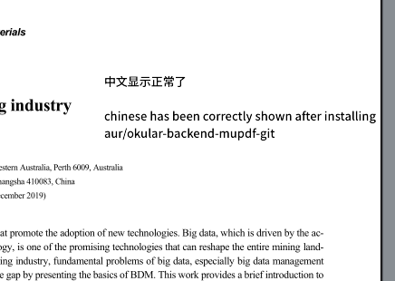

Updata: 方法没太大用，注释不能保存在pdf文件，而只能保存为Okular archive的格式。

# 先上解决方案

看到[另一篇文章](https://zhuanlan.zhihu.com/p/375692874)提到了切换Okular的pdf渲染引擎得到更好的渲染效果。突然想到Okular注释中不能显示中文是因为popple的渲染引擎问题，感觉说不定有用，果然可以。

编译安装https://github.com/gustawho/okular-backend-mupdf中的代码，安装后Okular会直接可以使用中文注释。Arch系可以直接AUR仓库安装，其它发行版可以参考PKGBUILD中的步骤。

显示效果如下：

# 一些其它的解决

1. 安装poppler-data包，没有安装会不支持unicode。
2. 如果是中文输入法不能用，参考使用的fcitx或ibus的环境变量设置方法。

# 其它

Okular默认使用popple作为pdf的渲染引擎，但是前段时间的更新中引入了一个bug（两年前用过Okular不记得是没用到还是那时候是好的），能够显示中文，但是中文的注释无法显示，导致注释功能中输入的中文直接显示为空。

官方好像没有要修复的意思，[讨论地址](https://gitlab.freedesktop.org/poppler/poppler/issues/362%EF%BC%89)。而大部分linux开源编辑器都是基于popple，有点尴尬。

能有较好文字注释功能的就只有masterpdf、foxit reader等几个闭源的pdf阅读器。foxit除了ctrl+c的复制不能用（可以用鼠标复制）这个小bug，其它的都很不错，虽然官方已经停止更新。没想到pdf注释这种刚需的问题没有被解决得太好。

