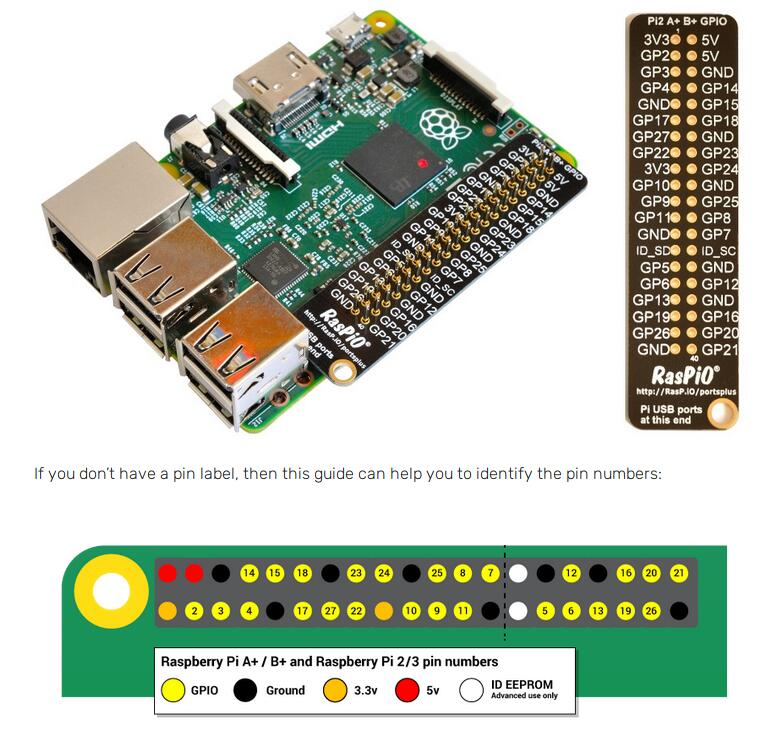

感觉这方面的资料最好优先google英文的，中文博客上竟然连scratch2用的哪套GPIO的编号都找半天...

树莓派的apt仓库里有三个scratch版本，其中scratch为稳定版，scratch2和scratch3还在测试仓库，改成了基于跨平台技术electron的开发。我在树莓派3b上scratch3打开没反应，scratch2虽然是测试版，但使用没发现问题，打开速度上明显比scratch慢。

scratch2相比scratch在GPIO上简化了大量的操作，不用通过广播的形式发送各种GPIO server的消息，将GPIO的操作简化成了两个函数。

# 1. 安装Scratch2

`sudo apt install scratch2`

# 2. 控制相关的GPIO口

`更多模块` -> `添加扩展`   选择`Pi GPIO`

下面会多出两个控制GPIO的函数。

`set gpio *id* to *output high*`  此函数用于设置gpio口，第一个指定GPIO的id，第二个指定功能，如输出高电平、输入低电平、输入模式。

`gpio *id* is high?`  此函数用于控制语句中作为条件，判断当前gpio口是否为高电平，通常用在输入模式下检测传感器一类的输入。

就这么简单，剩下的当成简单单片机用就行了。

# GPIO 针脚图

树莓派有多种GPIO的编号方式，使用python等调用需要指定具体的编码，scratch用的是下图这种（图源自树莓派官网）。

